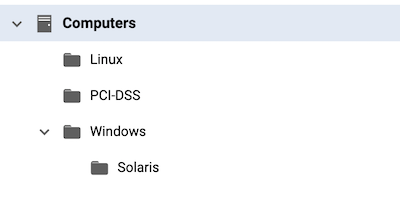

# Moving your Group Structure from Deep Security to Cloud One Workload Security

In order to help you in the migration process from Deep Security to CLoud One Workload Security, this script to help you on the group migration from Deep Security to Cloud One Workload Security

## What does this script do?

This script will collect your current group structure and creating the exact same in the Workload Security via API.

## Requirements:

* **Cloud One Workload Security**:

    - Have a [Cloud One Workload Security](https://www.trendmicro.com/en_ae/business/products/hybrid-cloud/cloud-one-workload-security.html) account. [Sign up for a free trial now](https://cloudone.trendmicro.com/register) if it's not already the case!

    - An [API KEY](https://cloudone.trendmicro.com/docs/account-and-user-management/c1-api-key/#create-a-new-api-key) with **"Full Access"** permission;

* **Deep Security Manager**:

    - An [API KEY](https://help.deepsecurity.trendmicro.com/20_0/on-premise/api-key.html) with **"READ ONLY"** permissions, for more details on roles, check this [link](https://help.deepsecurity.trendmicro.com/20_0/on-premise/user-roles.html);

    - Network access from the machine that you will execute the script to the Deep Security Manager;

    - This script was tested on **Deep Security Version 20.0.393**

* **General Requirements**:

    - This script was tested on **Centos 8.3.2011** and **Ubuntu 20.04.3 LTS** using a Docker container;

    - It require a [jq](https://stedolan.github.io/jq/) and [curl](https://curl.se/) installed on the machine that will execute the script;

## Usage

Clone this repository to the machine that you will use or download the ```groupmover.sh```. Edit the file by setting the variables so the script will be able to execute API calls, these are the variables that you should set in the script:

```bash
# For Deep Security:
DSAPIKEY="My DSM API KEY"
DSM="My DSM URL or IP Address"
DSMPORT="My DSM port, eg. 4119"

# For Cloud One Workload Security:
APIKEY="My Cloud One API KEY"
REGION="My Cloud One Region, eg. US-1"
SERVICE="Destination service" # Is already set to workload so you don't need to change.
```

Then you're ready to execute the script, in this example I'm moving these groups:



```bash
root@058310e2bd3a ./script.sh

 - Adding all root Groups to Workload Security...

{"type":"folder","name":"Windows","description":"My Windows Group","ID":444}
{"type":"folder","name":"Linux","description":"My Linux Machines","ID":445}
{"type":"folder","name":"PCI-DSS","description":"Sensitive Machines","ID":446}

 - Adding all Sub-Groups to Workload Security...

{"type":"folder","name":"Solaris","description":"Legacy Machines","parentGroupID":444,"ID":447}

No more groups to be added :)
```

In case you try to add a group that already exists, the API will return the appropriate message:

```bash
root@058310e2bd3a:/home ./script.sh

 - Adding all root Groups to Workload Security...

{"message":"Group \"Windows\" already exists."}
{"message":"Group \"Linux\" already exists."}
{"message":"Group \"PCI-DSS\" already exists."}

 - Adding all Sub-Groups to Workload Security...

{"message":"Group \"Solaris\" already exists."}

No more groups to be added :)
```

PS.: The script was tested with up to 4 levels of sub-groups, but should work just fine even with more levels.

## Contributing

If you encounter a bug, think of a useful feature, or find something confusing
in the docs, please
[Create a New Issue](https://github.com/felipecosta09/DS-to-C1WS-group-mover/issues/new)!

We :heart: pull requests. If you'd like to fix a bug, contribute to a feature or
just correct a typo, please feel free to do so.

If you're thinking of adding a new feature, consider opening an issue first to
discuss it to ensure it aligns with the direction of the project (and potentially
save yourself some time!).

## Support

Official support from Trend Micro is not available. Individual contributors may
be Trend Micro employees, but are not official support.


